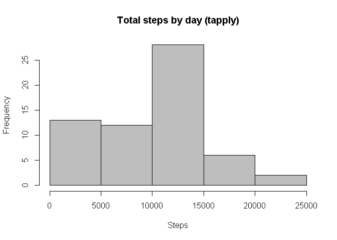
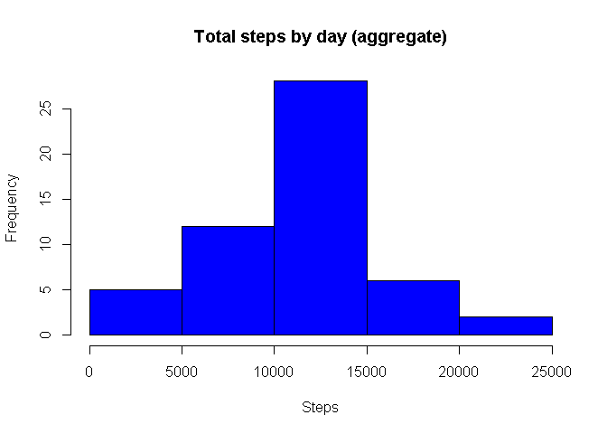
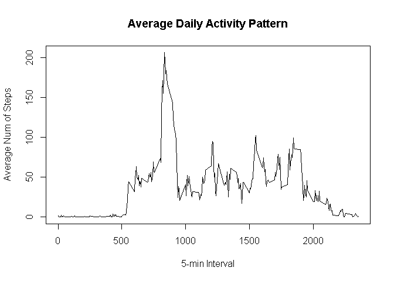
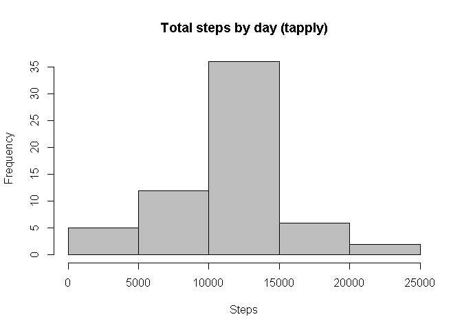
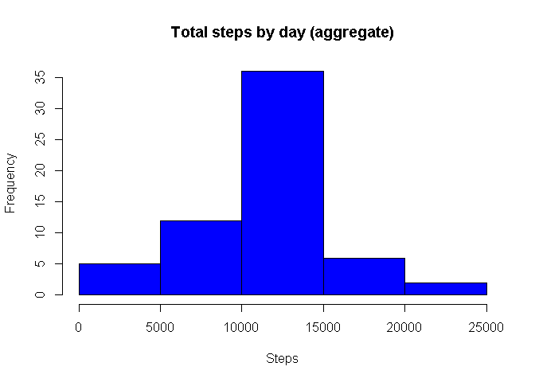
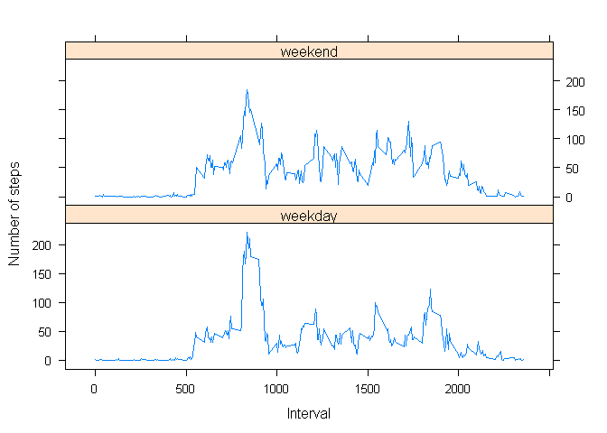

# Reproducible Research: Peer Assessment 1


## Loading and preprocessing the data


```r
#loading data


data <- read.csv("activity.csv", header=T,sep=",", stringsAsFactors=F, na.strings="?",colClasses=c("numeric", "character", "numeric"))
#showing some data information
str(data)
```

```
## 'data.frame':	17568 obs. of  3 variables:
##  $ steps   : num  NA NA NA NA NA NA NA NA NA NA ...
##  $ date    : chr  "2012-10-01" "2012-10-01" "2012-10-01" "2012-10-01" ...
##  $ interval: num  0 5 10 15 20 25 30 35 40 45 ...
```

```r
#converting dates strings to date variables
data$date <- as.Date(data$date, "%Y-%m-%d")
```

## What is mean total number of steps taken per day?

There are two different posibilities to calculate the number of steps per day and they produce slightly different results according to how empty days are considered:

1. tapply treats empty days as days with zero steps.

2. aggregate just ignores empty days.

Thus the difference in histograms as we can appreciate in next results shown


```r
#Calculate the total number of steps taken per day
stepsByDay1 <- tapply(data$steps, data$date, sum, na.rm=TRUE)
#Make a histogram of the total number of steps taken each day
hist(stepsByDay1, main = "Total steps by day (tapply)", xlab = "Steps", col = "gray")
```

 

```r
#Calculate and report the mean and median of the total number of steps taken per day
average1 <- mean(stepsByDay1)
med1<- median(stepsByDay1)

#Calculate the total number of steps taken per day
stepsByDay2 <- aggregate(steps ~ date, data = data, sum, na.rm = TRUE)
#Make a histogram of the total number of steps taken each day
hist(stepsByDay2$steps, main = "Total steps by day (aggregate)", xlab = "Steps", col = "blue")
```

 

```r
#Calculate and report the mean and median of the total number of steps taken per day
average2 <- mean(stepsByDay2$steps)
med2 <- median(stepsByDay2$steps)
```
The mean and median values calculated with tapply aproach are:

mean: 9354.2295082

median: 1.0395\times 10^{4}

Compared to de values calculated with the aggregate aproach:

mean: 1.0766189\times 10^{4}

median: 1.0765\times 10^{4}


## What is the average daily activity pattern?
Make a time series plot (i.e. type = "l") of the 5-minute interval (x-axis) and the average number of steps taken, averaged across all days (y-axis)


```r
avgstepsperinterval <- tapply(data$steps, data$interval, mean, na.rm = TRUE)
avgstepsperinterval2 <-  cbind.data.frame(interval = as.integer(names(avgstepsperinterval)), steps = avgstepsperinterval)
plot(avgstepsperinterval2$interval, avgstepsperinterval2$steps, type = "l", xlab = "5-min Interval", ylab = "Average Num of Steps", main = "Average Daily Activity Pattern")
```

 

```r
#plot(as.integer(names(avgstepsperinterval)), avgstepsperinterval)

maxavginterval = avgstepsperinterval2$interval[avgstepsperinterval2$steps == max(avgstepsperinterval2$steps)]
maxavginterval
```

```
## [1] 835
```

Which 5-minute interval, on average across all the days in the dataset, contains the maximum number of steps?
The 5-minutes interval that on average contains the maximum number of steps is the 835 


## Imputing missing values
Calculate and report the total number of missing values in the dataset

```r
missingValues <- sum(is.na(data$steps))
missingValues
```

```
## [1] 2304
```
NA Values will be replaced by the average value of the corresponding 5-minute interval

Create a new dataset that is equal to the original dataset but with the missing data filled in.

```r
stepValues <- data.frame(data$steps)
stepValues[is.na(stepValues),] <- ceiling(tapply(X=data$steps,INDEX=data$interval,FUN=mean,na.rm=TRUE))
newdata <- cbind(stepValues, data$date,data$interval)
colnames(newdata) <- c("steps", "date", "interval")
str(newdata)
```

```
## 'data.frame':	17568 obs. of  3 variables:
##  $ steps   : num  2 1 1 1 1 3 1 1 0 2 ...
##  $ date    : Date, format: "2012-10-01" "2012-10-01" ...
##  $ interval: num  0 5 10 15 20 25 30 35 40 45 ...
```

Make a histogram of the total number of steps taken each day and Calculate and report the mean and median total number of steps taken per day. Do these values differ from the estimates from the first part of the assignment? What is the impact of imputing missing data on the estimates of the total daily number of steps?

```r
#Calculate the total number of steps taken per day
stepsByDay3 <- tapply(newdata$steps, newdata$date, sum, na.rm=TRUE)
#Make a histogram of the total number of steps taken each day
hist(stepsByDay3, main = "Total steps by day (tapply)", xlab = "Steps", col = "gray")
```

 

```r
#Calculate and report the mean and median of the total number of steps taken per day
mean(stepsByDay3)
```

```
## [1] 10784.92
```

```r
median(stepsByDay3)
```

```
## [1] 10909
```

```r
#Calculate the total number of steps taken per day
stepsByDay4 <- aggregate(steps ~ date, data = newdata, sum, na.rm = TRUE)
#Make a histogram of the total number of steps taken each day
hist(stepsByDay4$steps, main = "Total steps by day (aggregate)", xlab = "Steps", col = "blue")
```

 

```r
#Calculate and report the mean and median of the total number of steps taken per day
mean(stepsByDay4$steps)
```

```
## [1] 10784.92
```

```r
median(stepsByDay4$steps)
```

```
## [1] 10909
```

As we can see in both histograms generated in this block, after replacing NA values, both aproaches seem to behave in a way closer to the initial aproach using the aggregate function (that just ignored the missing days, instead of consider them as days with zero stepts)

## Are there differences in activity patterns between weekdays and weekends?
Create a new factor variable in the dataset with two levels - "weekday" and "weekend" indicating whether a given date is a weekday or weekend day.


```r
datedaytype <- data.frame(sapply(X = newdata$date, FUN = function(day) {
    if (weekdays(as.Date(day)) %in% c("lunes", "martes", "miercoles", "jueves", "viernes")) {
        day <- "weekday"
    } else {
        day <- "weekend"
    }
}))

datawithdaytype <- cbind(newdata, datedaytype)
colnames(datawithdaytype) <- c("steps", "date", "interval", "daytype")
```


Make a panel plot containing a time series plot (i.e. type = "l") of the 5-minute interval (x-axis) and the average number of steps taken, averaged across all weekday days or weekend days (y-axis). 


```r
library(lattice)

stepsbydaytype <- aggregate(steps ~ daytype + interval , data = datawithdaytype, mean)
str(stepsbydaytype)
```

```
## 'data.frame':	576 obs. of  3 variables:
##  $ daytype : Factor w/ 2 levels "weekday","weekend": 1 2 1 2 1 2 1 2 1 2 ...
##  $ interval: num  0 0 5 5 10 10 15 15 20 20 ...
##  $ steps   : num  1.861 1.6 0.139 0.84 0.139 ...
```

```r
xyplot(type="l",data=stepsbydaytype,steps ~ interval | daytype,
    xlab="Interval",ylab="Number of steps",layout=c(1,2)
)
```

 


